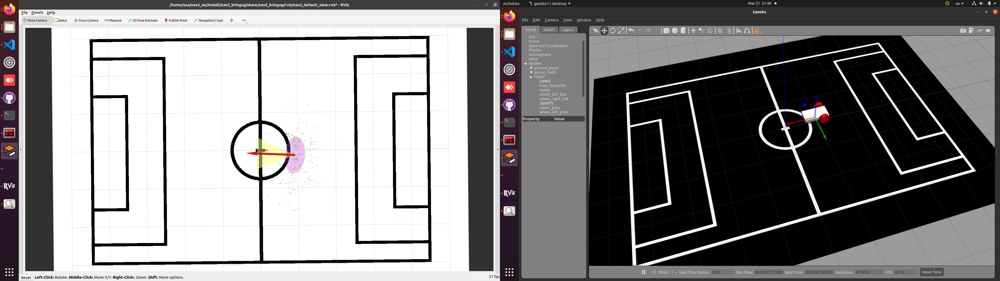
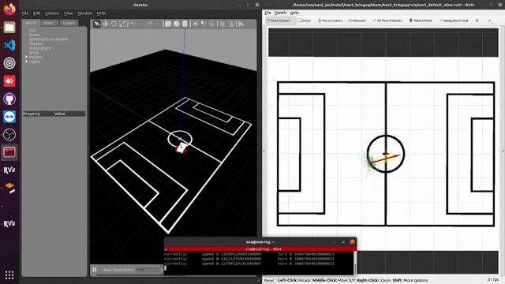

<h1 align="center">Localization </h1>

Repository นี้คือ implementation ของระบบ localization สำหรับ Humanoid robot ด้วยข้อมูลจากกล้อง(ใช้ Lidar ไม่ได้) และเซนเซอร์ต่าง ๆ เช่น IMU รวมถึงข้อมูลจาก odom estimation เพื่อให้หุ่นยนต์รับรู้ข้อมูลตำแหน่งและทิศทางของตัวเอง และสามารถวางแผนกลยุทธ์การบุกและการรับของทีมได้



โดยแนวคิดการออกแบบในตอนนี้จะทำเป็น simulation เเละ คิดว่าภาพที่ได้จากกล้องผ่านการ segmentation เพื่อหาตำแหน่งเส้นสีขาวบนรูป โดยทำสนามฟุตบอลจำลองใน gazebo ให้บริเวณหญ้าเป็นพื้นสีดำเเละ เส้นสนามเป็นสีขาว

ขั้นตอนในการทำ
1. เเปลงภาพที่ได้จากกล้อง web camera ซึ่งภาพที่ได้มาเป็น perspective ให้เป็นภาพ Top view โดยใช้ IPM
2. หา pixel เฉพาะสีขาว(จากรูปที่กล้องมองเห็นหรือรูปที่ผ่านการ segment เพื่อแยกเส้นสนามสีขาวออกจากสนามสีเขียว) เเล้วเเปลงเป็น laserscan msg
3. นำlaserscan msg มาใช้ร่วมกับ amcl ของ navigation2


<!-- ROADMAP -->
# Roadmap
- [x] Setup gazebo environment
- [x] Camera to topview 
- [x] topview to laserscan msg in simulation
- [x] camera move in pitch and yaw (simulation) # note not good in simulation!!!
- [ ] Localize with AMCL(Nav2) in simulation
  - [ ] [in progress 90%] by only camera to laserscan [ระบุตำแหน่งได้แล้ว แต่เฟรม odom มีปัญหา ถ้าsimจะเห็นว่าเฟรมค่อยๆจางลงเป็นสีเทาซึ่งมันไม่ควรจะเป็นแบบนั้น]
  - [ ] by sensor fusion (IMU + odom + camera to laserscan) 
- [ ] topview to laserscan msg in real world (waiting segmentation node from AI team)
- [ ] implement Localization in real world

# Table of Contents

1. [System requirements](#System-requirements)
2. [Installation](#Installation)
3. [Quickstart](#Quickstart)
4. [Suggestion](#Suggestion)
5. [Contact](#Contact)
6. [Acknowledgments](#Acknowledgments)

<a name="System-requirements"></a>
# System requirements
  
* Ubuntu 20.04 
* ROS2 (Foxy)
  
<!-- <a name="Built-With"></a>
# Built With

This section should list any major frameworks/libraries used to bootstrap your project. Leave any add-ons/plugins for the acknowledgements section. Here are a few examples.

* [![docs][docs.ros]][https://docs.ros.org/en/foxy/index.html]
* [![React][React.js]][React-url]
* [![Vue][Vue.js]][Vue-url] -->
  
<!-- # Document
this document be a part of FRA506 humanoid. In this document including of introduction content conclusion and suggestion -->

<a name="Installation"></a>
# Installation
  
### 1. Install opencv
```
pip3 install opencv-python
```
### 2. Install navigation2
```
sudo apt install ros-foxy-navigation2
```
<!-- ## install ros2-control
```
sudo apt install ros-foxy-ros2-control ros-foxy-ros2-controllers ros-foxy-gazebo-ros2-control
``` -->

<a name="Quickstart"></a>
# Quickstart
                   
### 1. Spawn robot in gazebo.
               
```                
ros2 launch fibot_gazebo spawn2.launch.py               
```
### 2. Start camera to laserscan node.

```
ros2 run localization_pkg py_node_champ.py 
```

### 3. Start nav2 to use AMCL for localization.
```
ros2 launch localization_pkg nav2.launch.py
```
### 4. Start teleop node
```
ros2 run tele
```
### 5. then move the robot by teleop, you will see like below.


              
# About camera to topview(IPM)
source: https://github.com/ika-rwth-aachen/Cam2BEV/tree/master/preprocessing/ipm

<a name="Suggestion"></a>
# Suggestion

1. ต้องทำให้เฟรม odom ไม่หายตอน sim เพราะโดยปกติไม่ควรเกิดเหตุการณ์นี้ขึ้นกับการใช้แพคเกจ Nav2
2. code ที่แปลงภาพเป็น topview ด้วยฟังชัน warpperspective ใช้เวลาค่อนข้างนาน ทำให้คำนวณไม่ทัน  30 fps และเคยทดลองให้ใช้ cuda ช่วยคำนวณแล้วได้ 30 fps++ แต่นานๆที่ตกไป 20 fps
3. ตอนใช้จริงอาจมีปัยหาพอสมควร เช่น ภาพน่าจะสั่นไหวอาจะทำให้การอ่านค่าตำแหน่งเส้นสนามมีความผิดพลาดได้
4. ขอมูลจาก laserscan ที่ได้จากการแปลงจาก topview จะมีขนาด list = 360(องศา) x จำนวน range ที่ซ้อนกันมากสุด เช่น ใน 1 angle มีระยะ 3 และ 5 เมตร (range = 2) แสดงว่าข้อมูล laserscan จะเท่ากับ len ของ list = 360x2 = 720 ซึ่งตอนใช้งานจริงอาจมีเป็น 100 range ได้ จะทำให้ list มีขนาดยาวมาก ไม่แน่ใจว่าจะส่งผลต่อการคำนวณใน AMCL ไหม เพราะฉะนั้นอาจต้องหาวิธีแก้ปัญหานี้                
<!-- CONTACT -->
  
<a name="Contact"></a>
# Contact

### Patcharapon Thaweepanyayos - patcharaponthaweepanyayos@gmail.com
### Piamsuk Noipong - piamsuk.robot@mail.kmutt.ac.th
Project Link: [https://github.com/fibohumanoidlab/FIBOT_Github/tree/localization](https://github.com/fibohumanoidlab/FIBOT_Github/tree/localization)


  
  
<!-- ACKNOWLEDGMENTS -->
                                       
<a name="Acknowledgments"></a>
# Acknowledgments

Use this space to list resources you find helpful and would like to give credit to. I've included a few of my favorites to kick things off!

* [navigation2](https://navigation.ros.org/getting_started/index.html#getting-started)
* [ros2 control example](https://articulatedrobotics.xyz/mobile-robot-12-ros2-control/)
* [Malven's Flexbox Cheatsheet](https://flexbox.malven.co/)
* [Malven's Grid Cheatsheet](https://grid.malven.co/)
* [Img Shields](https://shields.io)
* [GitHub Pages](https://pages.github.com)
* [Font Awesome](https://fontawesome.com)
* [React Icons](https://react-icons.github.io/react-icons/search)


<!-- ## Code Contributors

This project exists thanks to all the people who contribute. 
<a href="https://github.com/fibohumanoidlab/FIBOT_Github/graphs/contributors">
  
</a>

  
 

## 🤝 Contributing

Contributions, issues and feature requests are welcome.<br />
Feel free to check [issues page](https://github.com/fibohumanoidlab/FIBOT_Github/issues) if you want to contribute.<br /> -->


### Note for Sua
"""sudo apt install ros-<ros2-distro>-robot-localization"""
  https://navigation.ros.org/setup_guides/odom/setup_odom.html
  
  อย่าลืมเพิ่ม <exec_depend>robot_localization</exec_depend>
  
  sudo apt install ros-foxy-ros2-control ros-foxy-ros2-controllers ros-foxy-gazebo-ros2-control
